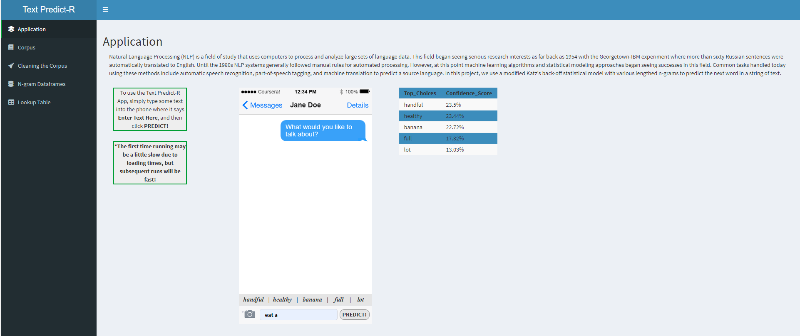

# Text-Prediction-Using-N-grams
The purpose of this project was to develop a model for predicting upcoming words in a sequence based on n-gram analysis. The approach taken greatly reduced memory and time needed for prediction by employing a reduced lookup table and an original modification of Katz's back-off model for n-grams. Final results had over 20% accuracy using top-5 predicitons with results in under 25ms. Final products are the following:
1. An interactive application
[Application](https://charlesbryan.shinyapps.io/Text_PredictR/)

2. A thorough walkthrough
[Walkthrough](https://rpubs.com/CharlesBryan/Text_Prediction)

3. A short slideshow presentation
[Presentation](https://rpubs.com/CharlesBryan/Text_Predict-R_slides)
